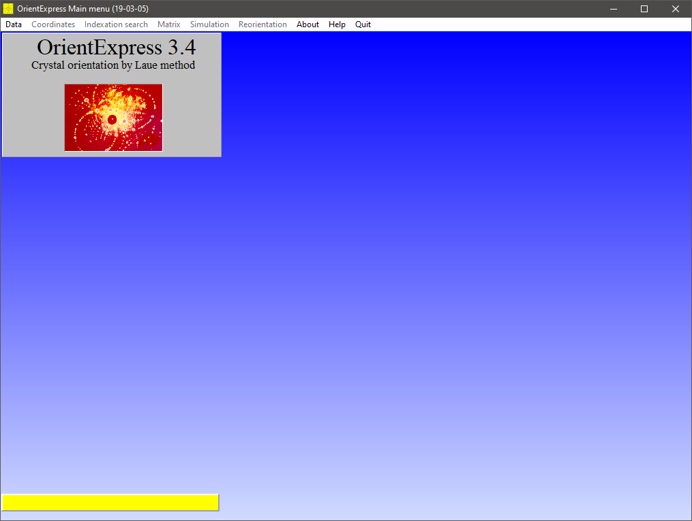
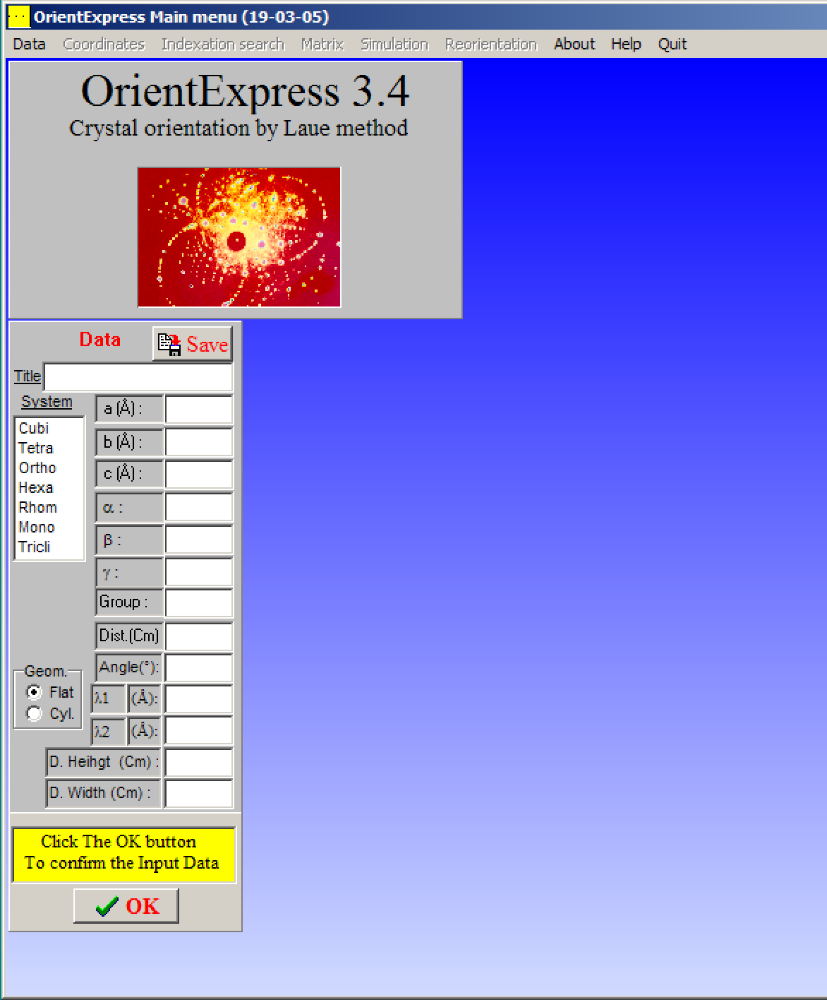
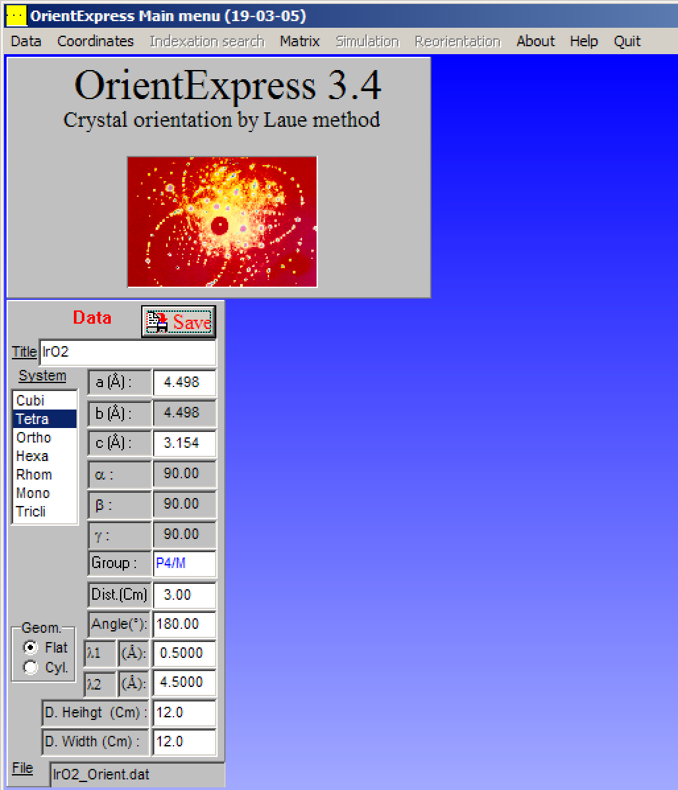
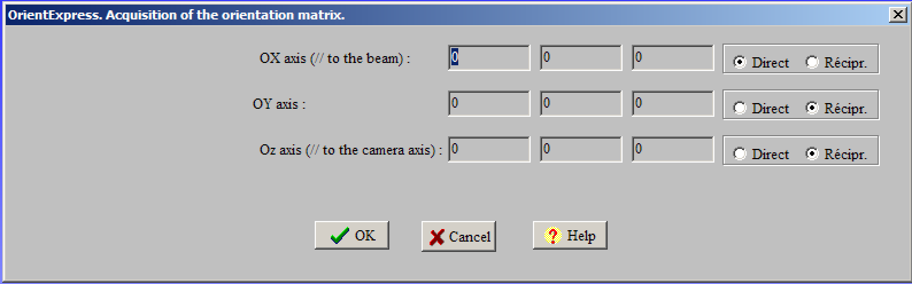
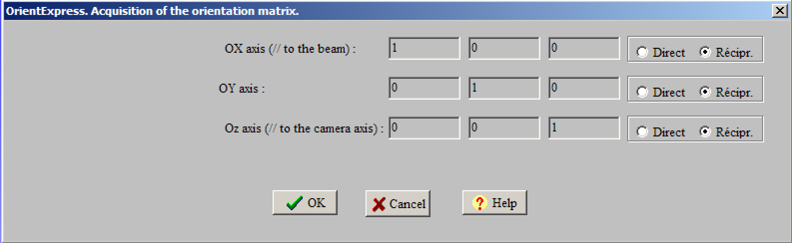
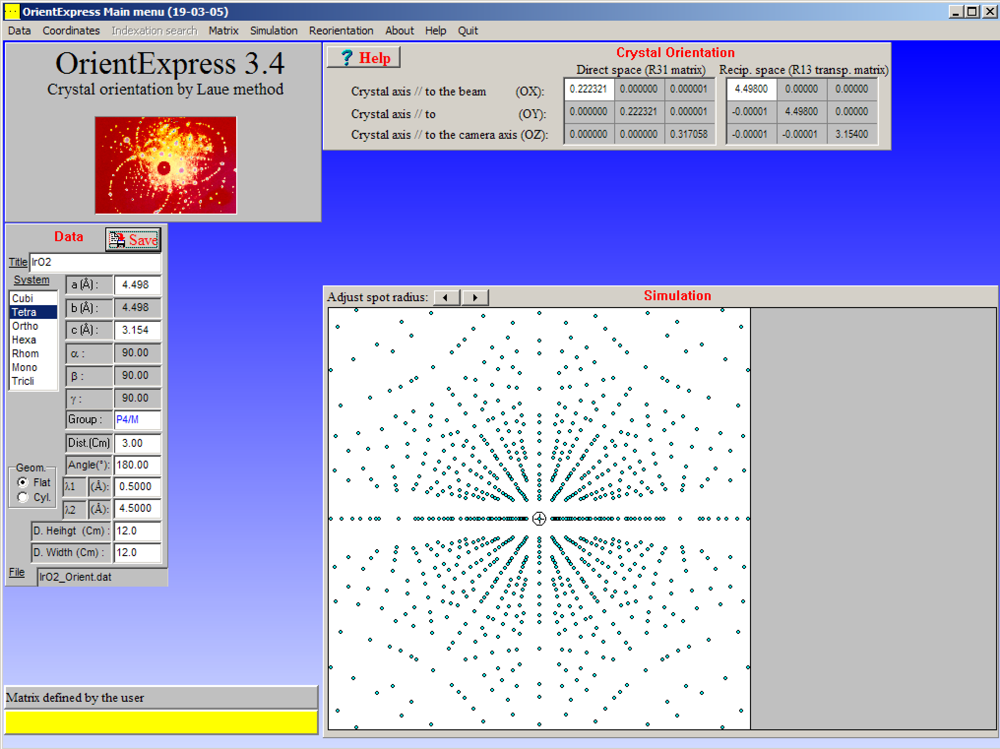
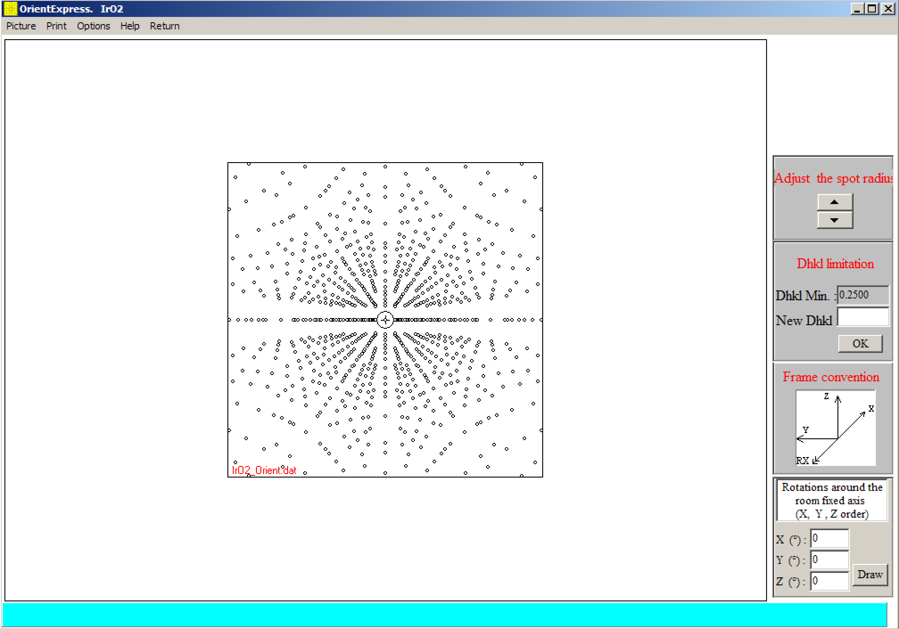
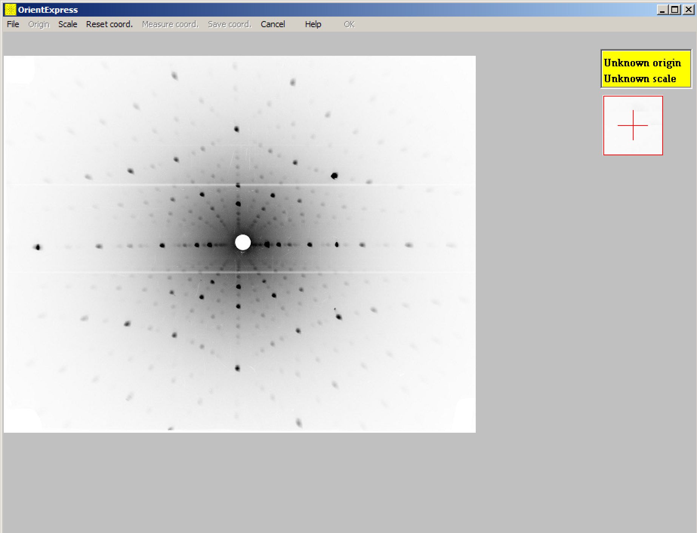
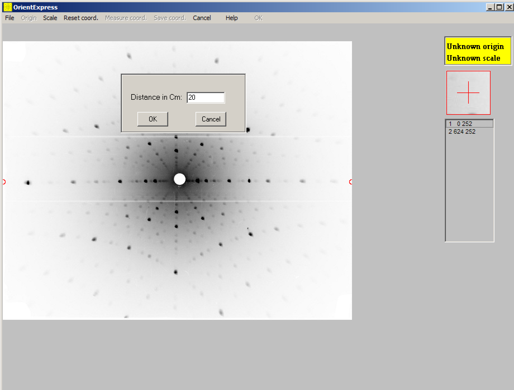
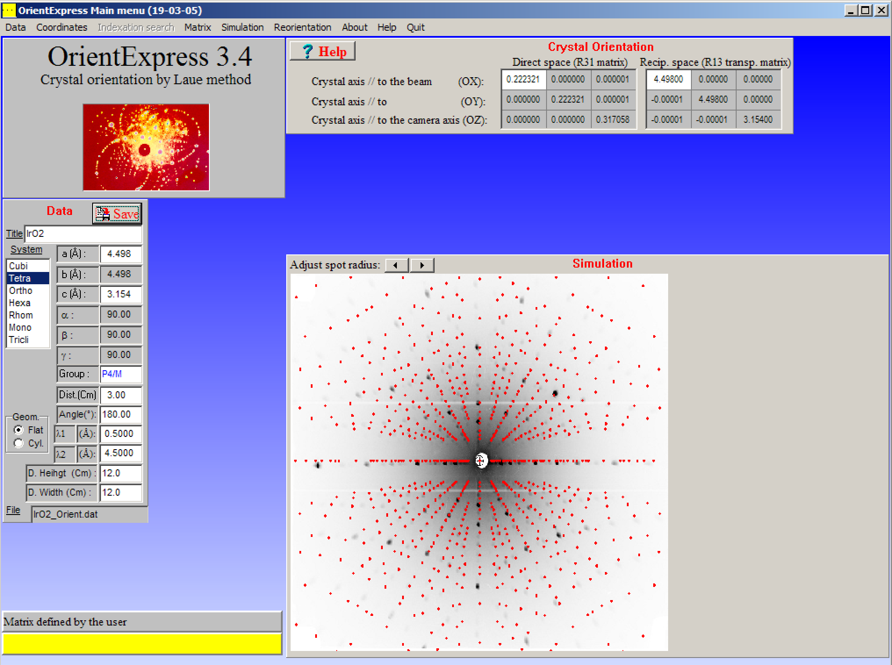

# Laue diffraction simulation using OrientExpress

Laue diffraction is a method to find the crystallographic direction of single
crystals. We shine the single crystal with white x-ray (having a continuous
range of wavelength), and record the diffracted pattern on a x-ray film or image
plate. Analyzing the pattern, we learn about the crystal structure. Sometimes we
need to compare the observed pattern with a simulated pattern to identify a
crystallographic plane. Here is how we can simulate the Laue pattern of a single
crystal. This tutorial is meant for the first-time users.

- Download OrientExpress [here](
http://ccp14.cryst.bbk.ac.uk/ccp/web-mirrors/lmgp-laugier-bochu/orientex.zip)
and unzip in a Windows computer. Click **OrientExpress.exe** to launch the
program. Below is the Main Window you will see once you launch OrientExpress.

- To simulate Laue pattern of a single crystal, we need to insert the required
parameter in OrientExpess. We can choose to insert the parameter manually. Go to
menu bar Data >> Keyboard. You will see following window:

- Let’s simulate Laue pattern for IrO2 single crystal (right now I
have the parameter for this compound, but you can try with any other compound).
IrO2 has tetragonal crystal structure, note the respective parameters
in the following window:

- Here a, b, c are lattice constants. α, β, γ are angles between principle axes.
Group is space group of the crystal structure. Dist.(Cm) is the distance between
single crystal surface and Laue recording x-ray film or image plate. Angle(°)
depends on the geometry of the Laue setup. In case of metals (like in our
example IrO2), we record the back-scattered x-ray pattern. In this
case Angle 180°. In some cases of transparent single crystals, we record the
transmitted pattern, in that case, Angle = 0°. λ1 and λ2 are lower and upper
limit of x-ray source we are using for the experiment. Height and Width
corresponds the height and width of the x-ray recording film or the dimensions
of Image plate.

- You can save these data in a `.dat` file for future use. Just click the Save
button on the top right of Data input window.

- Next time, if you like to load this saved data, choose File from Data menu,
and navigate to the data file.

- Now we are ready to simulate the Laue pattern. First let’s see the Laue
pattern for [100] crystallographic direction.

- Go to Matrix >> Acquisition in the menu bar. You will see following window:

- Here we need to insert the crystallographic directions of our crystal we want
to simulate. Here is an example:

- Please select Récipr. (stands for reciprocal space). Click OK, and here it is.

- Congratulations! Now you know how to simulate Laue pattern of any single
crystal with known lattice parameters. Very simple, isn’t it? Now I will
describe couple of useful techniques which you may find useful.

- Rotating the pattern to see the changes. Go to Simulation >> Laue in the menu
bar.

- Now you can put degree of rotation with respect to rotation axes and click
Draw. That’s it.

- Another feature maybe be very useful: superimposing a simulated patter over
the experimental pattern.

- Please save your experimental Laue pattern in .jpg (or another supported
format). Note: sometimes I noticed that high resolution images show some scaling
problem, in that case please scale down the resolution. The image file I am
using is 625 pixels by 500 pixels.

- Go to menu bar: Coordinates >> Image and browse your image file.

- Next we need to set the scale. Go to Scale >> Measure, then I click at two
points on the horizontal axis and enter the horizontal dimension of my image
plate.

- Then we need to set the Origin, Go to Origin >> Point, and click in the center
of the film/pattern.

- In the main window, you should see something like this:

- That’s all from me. Now you may want to explore further yourself. Happy
learning!
